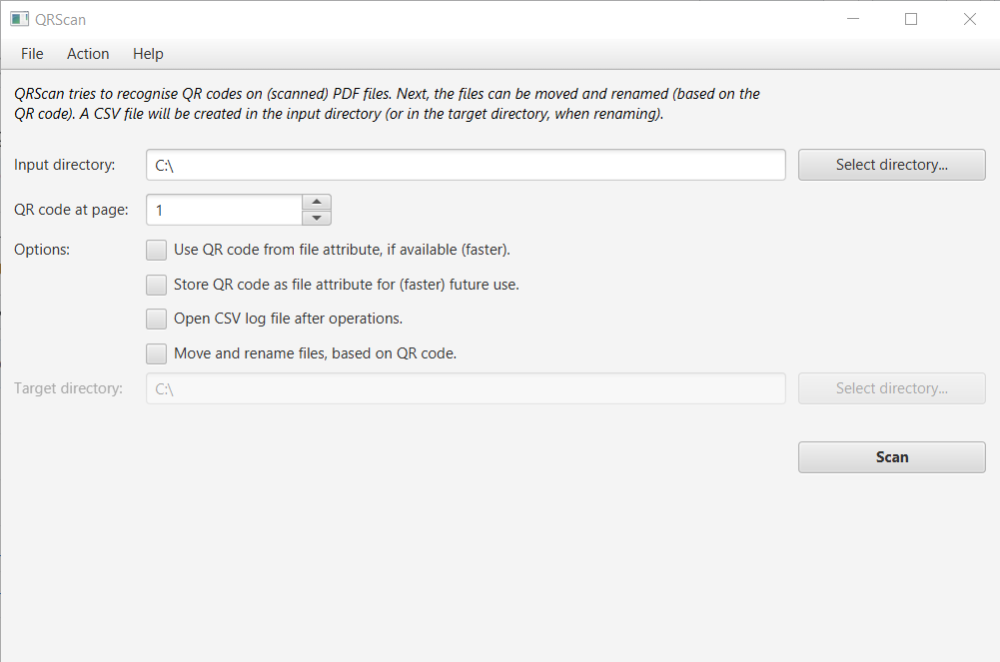

# QRScan: recognition of QR codes in PDF files of scanned documents

If you have a large collection of PDF files of scanned documents, QRScan can help you keep track of your documents and set up basic file archiving. QRScan recognizes QR codes in PDF files of scanned documents and then reports these QR codes in a CSV file. QRScan can move and rename the PDF files according to their QR code. 

We used the QRScan tool to send questionnaires labeled with individual QR codes. For the returned questionnaires, we used QRScan to register and to archive the scanned responses.

# Detailed functions
* QRScan can generate GIF image files with QR codes if you provide a simple text file with the codes you want to be used (with one code at each line). You can incorporate these QR codes in any documents (e.g. forms) you want to print (and later scan to PDF and manage with QRScan again). See for example this guide on how to use Microsoft Word's mail merge feature to add the images: [Two ways to batch insert multiple images in a Word document via mail merge](https://www.datanumen.com/blogs/2-ways-batch-insert-multiple-pictures-word-document-via-mail-merge/).
* When renaming, QRScan appends sequential numbers as a suffix if PDF files share the same QR code to prevent clashing file names.
* When scanning, QR codes can be stored as a file attribute for faster future reference. 
* If automatic QR code recognition fails, you can manually add the file attribute to the PDF file. 

Good QR code recognition has been attained with documents that were scanned at a resolution of 300 DPI.

# Installation
The [provided executable JAR](https://github.com/LS31/qrscan/releases) is ready to use. The current version runs with Java 14. You need to have a recent Java Virtual Machine ([Java Runtime Environment](https://java.com/en/download/)) installed to execute the JAR file. On Windows, simply double-click the JAR file to execute. 

# Acknowledgements
A big thanks to the following projects: [PDFBox by The Apache Software Foundation](https://pdfbox.apache.org/), [Java Advanced Imaging Image I/O Tools API](https://github.com/jai-imageio/jai-imageio-jpeg2000), and the [ZXing project](https://github.com/zxing).

# Release history
* **1.0.0**
  * First release.
* **2.0.0**
  * Update to JDK/JRE 13; use Java Platform Module System.
  * Minor changes in lay-out.
* **2.1.0**
  * Remember previous appSettings when restarting program.
  * Added progress dialog windows.
  * Updated logging (and simplified for end user).
  * Updated to JDK/JRE 14.
  * Updated versions of all dependencies.
